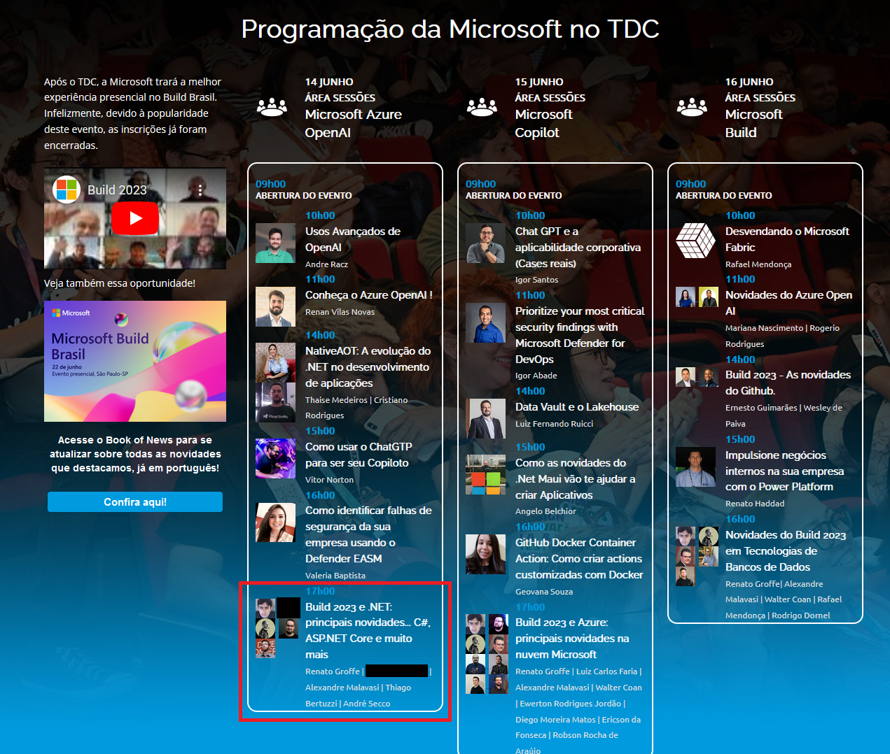

# Talk-Build2023-DotNet-TDC_Innovation2023
Informações (incluindo fotos + prints) sobre apresentação online abordando novidades na plataforma .NET anunciadas durante a edição 2023 do Microsoft Build. Talk realizada durante o TDC Innovation 2023 no dia 14/06/2023 (quarta-feira).

Título da apresentação -> **Build 2023 e .NET: principais novidades... C#, ASP.NET Core e muito mais**

Página do evento: [**TDC**](https://promo.thedevconf.com/inn23-microsoft)

Público que acompanhou a apresentação: **61 pessoas** (pico de audiência ao longo da live)

Palestrantes:
- Renato Groffe (Microsoft MVP, MTAC)
- Thiago Bertuzzi (Microsoft MVP)
- André Secco (Microsoft MVP, MTAC)
- Alexandre Malavasi (Microsoft MVP)

Tecnologias abordadas: **.NET, ASP.NET Core, Visual Studio 2022, Visual Studio Code, GitHub Copilot, OpenAI**

Na pasta [**/img**](img/) estão outros prints do evento.

Deixamos aqui nossos agradecimentos à **Stéfany Mazon** e à **Isabela Milhomem** pelo convite e por todo o apoio para que participássemos como palestrantes na **Sala Microsoft**.

---

